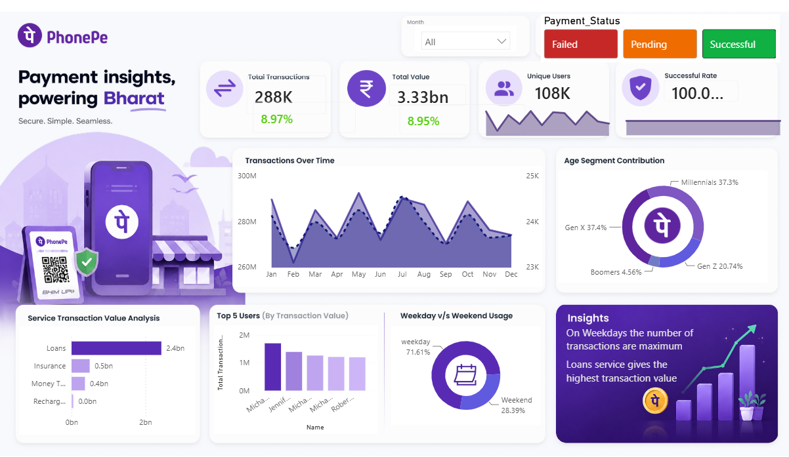

# 📊 PhonePe Data Analysis Dashboard | Power BI

<p align="center">


</p>

---

## 📌 Project Overview

Digital payment platforms generate enormous volumes of transaction data every day. Transforming this raw data into meaningful business insights helps organizations monitor performance, understand customer behavior, and make informed business decisions.

This project showcases an interactive **PhonePe Data Analysis Dashboard** developed using **Microsoft Power BI**. The dashboard provides a comprehensive view of digital payment transactions through dynamic visualizations, KPI cards, DAX calculations, slicers, and business insights.

As part of my Power BI learning journey, I recreated this dashboard by following the educational tutorial published by **Anushka Purwar** on the **DataCliq** YouTube channel. While the project workflow and dashboard design are based on the tutorial, building it helped me strengthen my practical understanding of Power BI development, data modeling, Power Query, DAX, and dashboard storytelling.

---

# 📸 Dashboard Preview


<p align="center">



</p>

---

# 🎯 Business Objectives

The dashboard helps analyze:

- Digital payment transaction performance
- Total transaction value
- Monthly transaction trends
- Customer usage patterns
- Payment success and failure rates
- Age-wise customer contribution
- Weekday vs Weekend transaction behavior
- Top performing users
- Service-wise transaction value

---

# 📊 Dashboard Features

### KPI Cards

- Total Transactions
- Total Transaction Value
- Unique Users
- Success Rate

### Interactive Analysis

- Payment Status Analysis
- Monthly Trend Analysis
- Service Transaction Analysis
- Age Segment Contribution
- Top Users
- Weekday vs Weekend Usage
- Dynamic Slicers
- Business Insight Panel

---

# 📈 Key Insights

- Weekday transactions are significantly higher than weekend transactions.
- Loan services contribute the highest transaction value.
- Millennials represent the largest customer segment.
- Payment success rate remains consistently high.
- Monthly filtering enables detailed trend analysis.
- Interactive visuals improve business decision-making.

---

# 📂 Dataset

The project uses two Excel datasets for dashboard creation.

Datasets Included:

- phonepe_dataset_1.xlsx
- phonepe_dataset_2.xlsx

---

# 🛠️ Tools & Technologies

- Microsoft Power BI
- Microsoft Excel
- Power Query
- DAX (Data Analysis Expressions)
- Data Modeling
- Data Visualization
- Business Intelligence

---

# 📚 Skills Practiced

During this project I strengthened my practical understanding of:

- Data Cleaning
- Power Query Transformations
- Data Modeling
- DAX Measures
- Interactive Dashboard Design
- KPI Development
- Business Storytelling
- Data Visualization Best Practices

---

# 📁 Repository Structure

```
phonepe-data-analysis-powerbi
│
├── Dashboard
│   └── phonepe-data-analysis-powerbi.pbix
│
├── Dataset 1
│   └── phonepe_dataset_1.xlsx
│
├── Dataset 2
│   └── phonepe_dataset_2.xlsx
│
├── Images
│   └── dashboard-preview.png
│
├── README.md
└── LICENSE
```

---

# 🎥 Dashboard Walkthrough

A short demonstration of the interactive dashboard is available on my LinkedIn profile.

🔗 **LinkedIn Demo:** *(Add your LinkedIn post URL here after publishing.)*

---

# 🙏 Acknowledgement

This project was recreated for educational purposes as part of my Power BI learning journey by following the excellent tutorial created by **Anushka Purwar** on the **DataCliq** YouTube channel.

I sincerely appreciate the effort invested in creating this educational content, which provided valuable guidance while helping me develop practical skills in Power BI, DAX, Power Query, and Business Intelligence reporting.

This repository documents my implementation of the dashboard as part of my Power BI learning journey. Full credit for the original educational content, dashboard design approach, datasets, and tutorial belongs to Anushka Purwar and the DataCliq YouTube channel.

---

# 🚀 Future Improvements

- Publish the dashboard using Power BI Service
- Add advanced DAX calculations
- Build additional drill-through pages
- Optimize dashboard performance
- Integrate real-world datasets
- Implement Row-Level Security (RLS)

---

### Connect with me

- 💼 LinkedIn: https://www.linkedin.com/in/riddhi-bhorde-0b06002a9/overlay/contact-info/
- 💻 GitHub: https://github.com/riddhi729

---

## ⭐ If you found this project helpful, consider giving it a Star.

Thank you for visiting this repository!
